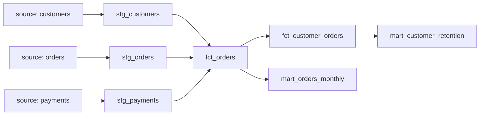

# dbt Project

## Purpose

This project is a personal practice environment for building and testing dbt data models locally, without connecting to a cloud data warehouse. It uses the Jaffle Shop dataset (a fictional food delivery company) as the data source.

The goal is to practice the full dbt workflow: loading raw data, building a staging layer, creating fact tables, mart tables, writing tests, and documenting models.

## Stack

| Tool | Role |
|------|------|
| dbt Core | Transformation and modeling |
| DuckDB | Local data warehouse |

## Project Structure

```
jaffle_shop/
├── seeds/               # Raw CSV data loaded into DuckDB
│   ├── customers.csv
│   ├── orders.csv
│   └── payments.csv
├── models/
│   ├── staging/         # Clean and rename raw data
│   │   ├── stg_customers.sql
│   │   ├── stg_orders.sql
│   │   ├── stg_payments.sql
│   │   └── _staging_schema.yml
│   ├── facts/           # Fact tables
│   │   ├── fct_orders.sql              # Incremental model
│   │   └── fct_customer_orders.sql
│   └── marts/           # Aggregate mart tables
│       ├── mart_orders_monthly.sql
│       └── mart_customer_retention.sql
```

## Lineage



## Data Model

### Seeds (Raw Data)
- `customers` — one row per customer
- `orders` — one row per order
- `payments` — one row per payment

### Staging Layer
Cleans and renames raw data. No business logic.

- `stg_customers` — renamed columns, primary key test
- `stg_orders` — renamed columns, status accepted values test
- `stg_payments` — renamed columns, amount converted from cents to dollars

### Fact Tables
- `fct_orders` — one row per order, joins customers and payments. Built as an **incremental model** using the merge strategy.
- `fct_customer_orders` — one row per customer, aggregated order metrics (total orders, total spent, first and latest order date)

### Mart Tables
- `mart_orders_monthly` — order count per month
- `mart_customer_retention` — classifies customers as new or returning based on order count

## Incremental Model Convention

`fct_orders` uses an incremental pattern with a cutoff CTE:

```sql


,incremental_cutoff AS (
    SELECT COALESCE(MAX(order_date), '1900-01-01'::DATE) AS cutoff_date
    FROM {{ this }}
)


```

The filter is applied as an INNER JOIN on the cutoff CTE, not a WHERE clause.

## How to Run

```bash
# Load raw data
dbt seed

# Build all models
dbt build

# Full refresh (rebuilds incremental models from scratch)
dbt build --full-refresh
```

## What I Practiced

- Setting up a local dbt project with DuckDB
- Building a staging → facts → marts model structure
- Writing incremental models with a merge strategy
- Adding data tests (unique, not_null, accepted_values)
- Documenting models in YAML
- Git workflow (branching, commits, push to GitHub)